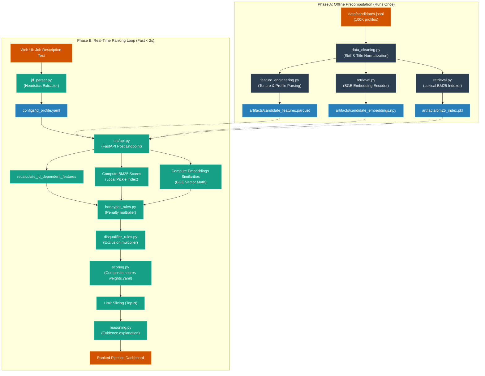

# RecruitIQ AI — System Architecture & Reference Manual

RecruitIQ AI is a premium, evidence-based hybrid candidate search and ranking intelligence platform. It is engineered to ingest raw Job Descriptions, automatically extract search parameters, run high-performance evaluations over massive candidate databases (such as a 100,000-candidate pool), penalize trust risks (honeypots/exclusions), and compile ranked pipelines with detailed reasoning summaries.

---

## 1. Core Architecture & Design Decisions

### 1.1 The "Why" Behind the Offline-First Split
In a real production environment (and matching the constraints of timed evaluation sandboxes), ranking a database of 100,000 candidates must be incredibly fast, cost-effective, and robust against network instability. RecruitIQ AI employs a **Precompute vs. Fast Re-scoring** architectural split:

| Layer | Precompute Phase (Phase A) | Dynamic Ranking Phase (Phase B) |
|---|---|---|
| **Timeline** | Offline (Developer Setup / Batch runs) | Real-time (Web UI requests / Timed steps) |
| **Duration** | ~15 minutes (Unbounded) | **Under 2 seconds** |
| **Compute** | Heavy (cleaning, embeddings, indexing) | Light (vector dot-products, file lookups) |
| **Network** | Offline (Local tokenizers/models) | **100% Network-Free** |

#### Why we do not call LLMs or Cloud APIs at ranking time:
1. **Latency**: Making 100,000 API requests sequentially or concurrently would take hours and crash under network rate limits.
2. **Network Dependency**: It violates the network-free constraint of evaluation sandboxes and adds runtime points of failure.
3. **API Costs**: Processing 100K candidates through external models (like OpenAI or Anthropic) would cost hundreds of dollars per rank query.

---
### 1.2 How Caching & Offline Math Work under the Hood

When a candidate pool (like the 487MB `data/candidates.jsonl` file) is submitted for ranking, the backend bypasses feature engineering completely by loading precomputed artifacts stored locally on disk.

1. **Static Feature Cache (`candidate_features.parquet`)**:
   Pandas reads the tabular data (containing raw years of experience, normalized titles, and company classifications) from the highly optimized Parquet format in under **100 milliseconds**. 
2. **Offline Lexical Fit (`bm25_index.pkl`)**:
   We pre-serialize a `rank-bm25` index containing all candidates' tokenized experience. When a new Job Description is submitted, the backend loads this index via `pickle` and queries the terms locally. This performs exact keyword matching without setting up an external search database (like Elasticsearch).
3. **Offline Semantic Fit (`candidate_embeddings.npy`)**:
   Candidate embeddings are stored in a raw NumPy array. Since both the candidate vectors and the BGE sentence-transformer model are loaded locally, computing semantic similarity is reduced to a fast **matrix dot product** (vector cosine similarity math), completed in milliseconds using NumPy/PyTorch.
4. **Dynamic JD Recalculation**:
   Only variables that change with the Job Description (e.g. *mandatory skill coverage*, *preferred skill coverage*, and *location fit scores*) are calculated dynamically. The backend updates these columns inside the dataframe, applies the weight tuning formula, filters out honeypots, and ranks the candidates.

---

## 2. System Architecture Flowchart

To ensure visibility across all Markdown editors, the pipeline flowchart is provided in both **ASCII Schema** (for text fallbacks) and **Mermaid Diagram** (for interactive rendering) formats:

### 2.1 ASCII Pipeline Flowchart
```
[ Phase A: Precompute Pipeline (Offline, runs during setup) ]
data/candidates.jsonl 
 ├─► data_cleaning.py ──────► Title & Skill Normalization
 ├─► feature_engineering.py ─► Parse experience & tenure ───► artifacts/candidate_features.parquet
 ├─► retrieval.py (BGE) ────► Dense Semantic Embeddings ───► artifacts/candidate_embeddings.npy
 └─► retrieval.py (BM25) ───► Lexical Token Corpus ────────► artifacts/bm25_index.pkl

[ Phase B: Real-Time Dynamic Re-scoring (Fast <2s, 100% Network-Free) ]
Job Description Text ─► jd_parser.py ─► configs/jd_profile.yaml
                                                 │
                                                 ▼
               artifacts/ ◄───────────────── src/api.py (FastAPI) ◄─ user-specified retrieve limit
      ├─ candidate_features.parquet              │
      ├─ candidate_embeddings.npy                ├─► recalculate coverages & location fit
      └─ bm25_index.pkl                          ├─► compute BM25 local match score
                                                 ├─► compute BGE vector similarity math (dot-products)
                                                 ├─► evaluate rules: honeypot_rules.py & disqualifier_rules.py
                                                 ├─► compute composite score (weights.yaml)
                                                 ├─► slice to Top N matching candidates
                                                 └─► reasoning.py (Evidence summary) ─► UI Dashboard
```

### 2.2 Interactive Mermaid Diagram


1. **Static Feature Cache (`candidate_features.parquet`)**:
   Pandas reads the tabular data (containing raw years of experience, normalized titles, and company classifications) from the highly optimized Parquet format in under **100 milliseconds**. 
2. **Offline Lexical Fit (`bm25_index.pkl`)**:
   We pre-serialize a `rank-bm25` index containing all candidates' tokenized experience. When a new Job Description is submitted, the backend loads this index via `pickle` and queries the terms locally. This performs exact keyword matching without setting up an external search database (like Elasticsearch).
3. **Offline Semantic Fit (`candidate_embeddings.npy`)**:
   Candidate embeddings are stored in a raw NumPy array. Since both the candidate vectors and the BGE sentence-transformer model are loaded locally, computing semantic similarity is reduced to a fast **matrix dot product** (vector cosine similarity math), completed in milliseconds using NumPy/PyTorch.
4. **Dynamic JD Recalculation**:
   Only variables that change with the Job Description (e.g. *mandatory skill coverage*, *preferred skill coverage*, and *location fit scores*) are calculated dynamically. The backend updates these columns inside the dataframe, applies the weight tuning formula, filters out honeypots, and ranks the candidates.

---

## 2. Technology & Modeling Choices

We chose lightweight, high-performance, and standard library components to keep the system serverless and robust:

### 2.1 BAAI/bge-base-en-v1.5 (Semantic Retrieval)
- **Why BGE?**: BGE (Beijing Academy of Artificial Intelligence) is one of the highest-rated open-source embedding models for semantic retrieval. 
- **Local Execution**: The `SentenceTransformer` library runs BGE locally on CPU (using `mps` acceleration on macOS, or `cpu` on standard sandboxes), eliminating external API calls.
- **Dimensionality**: Outputs compact 768-dimensional dense vectors, allowing us to store 100,000 vectors in a simple 300MB `candidate_embeddings.npy` file.

### 2.2 rank-bm25 (Lexical Retrieval)
- **Why BM25?**: BM25 is the industry-standard algorithm for TF-IDF keyword ranking. It ensures that candidates with exact matches for required technical stacks (e.g. `sentence-transformers`, `peft`) are surfaced, supplementing semantic matching.
- **Pickled Indexing**: Saving the tokenized corpus into `bm25_index.pkl` avoids runtime text parsing and tokenization.

### 2.3 Pandas & Parquet (Tabular Cache)
- **Why Parquet?**: Parquet is a columnar storage file format that offers high compression and high-speed reads compared to CSV or JSON. Loading 100K rows from a Parquet file takes a fraction of a second and keeps memory overhead minimal.

---

## 3. Directory Layout & Code Modules

- [src/api.py](file:///Users/piyushsaini/Downloads/RecruitIQ%20AI/src/api.py): FastAPI server exposing analysis and ranking routes. Caps final payloads to preventing browser out-of-memory crashes.
- [src/jd_parser.py](file:///Users/piyushsaini/Downloads/RecruitIQ%20AI/src/jd_parser.py): Extraction engine that scans raw JD text for skill requirements, locations, and notice period constraints.
- [src/feature_engineering.py](file:///Users/piyushsaini/Downloads/RecruitIQ%20AI/src/feature_engineering.py): Computes technical, career, and behavioral features.
- [src/honeypot_rules.py](file:///Users/piyushsaini/Downloads/RecruitIQ%20AI/src/honeypot_rules.py): Flags profile timeline overlaps, expert claims without tenure, and keyword-stuffing patterns.
- [src/disqualifier_rules.py](file:///Users/piyushsaini/Downloads/RecruitIQ%20AI/src/disqualifier_rules.py): Checks for strict exclusions (like consulting-only histories or pure research backgrounds).
- [frontend/src/App.jsx](file:///Users/piyushsaini/Downloads/RecruitIQ%20AI/frontend/src/App.jsx): Main dashboard showing a 3-step wizard with real-time weight sliders, candidate retrieval limits, and CSV export.

---

## 4. Setup and Run Instructions

Ensure Python 3.11+ and Node.js are installed.

### 1. Run the Backend API
```bash
# Create and activate virtual environment
python3 -m venv .venv
source .venv/bin/activate

# Install dependencies
pip install -r requirements.txt

# Start the server
python src/api.py
```
API runs on `http://localhost:8000`.

### 2. Run the Frontend Dashboard
```bash
cd frontend
npm install
npm run dev
```
Dashboard runs on `http://localhost:5173`.

### 3. Run Unit Tests
```bash
PYTHONPATH=. pytest tests/
```